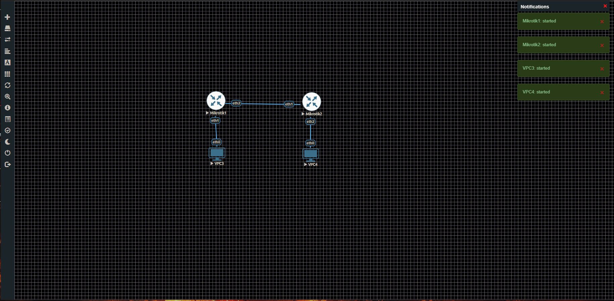
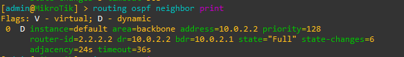
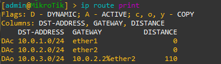
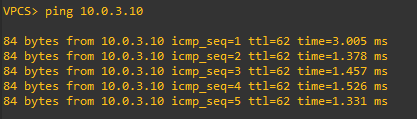

# Project 1 — Home Lab Topology with OSPF

## Overview
A simulated three-segment enterprise network built in EVE-NG using Mikrotik 
RouterOS CHR 7.1. Demonstrates IP addressing, network segmentation, and OSPF 
dynamic routing with verified end-to-end connectivity.

## Network Diagram
VPC3 (10.0.1.10) --- Mikrotik1 --- Mikrotik2 --- VPC4 (10.0.3.10)
10.0.1.1   10.0.2.1/10.0.2.2   10.0.3.1

## IP Address Table
| Device | Interface | IP Address |
|--------|-----------|------------|
| VPC3 | eth0 | 10.0.1.10/24 |
| Mikrotik1 | ether1 | 10.0.1.1/24 |
| Mikrotik1 | ether2 | 10.0.2.1/24 |
| Mikrotik2 | ether1 | 10.0.2.2/24 |
| Mikrotik2 | ether2 | 10.0.3.1/24 |
| VPC4 | eth0 | 10.0.3.10/24 |

## What I Built
- Configured IP addressing across 3 network segments
- Implemented OSPF dynamic routing (Area 0 backbone)
- Verified OSPF neighbor adjacency reached Full state
- Confirmed routing table populated automatically via OSPF (DAo routes)
- Verified end-to-end connectivity VPC3 → VPC4 with TTL=62 confirming 2 hops

## Evidence

### Topology

### OSPF Neighbor Adjacency — Full State

### Routing Table — OSPF Learned Routes

### End-to-End Ping — VPC3 to VPC4

### Router Configurations
- [Mikrotik1 Config](mikrotik1-config.txt)
- [Mikrotik2 Config](mikrotik2-config.txt)

## Troubleshooting Notes
- FRRouting image caused kernel panics in GNS3 due to VirtualBox 7.2 
  incompatibility — resolved by migrating to EVE-NG
- VirtualBox 7.2 incompatible with GNS3 VM — downgraded to 7.0.22
- Console access required manual port forwarding (32769/32770) from Windows 
  host to EVE-NG VM due to NAT networking

## Tools Used
- EVE-NG Community Edition 6.2.0
- Mikrotik RouterOS CHR 7.1
- VPCS (Virtual PC Simulator)
- VirtualBox 7.0.22

## Key Concepts Demonstrated
- IP subnetting and interface addressing
- OSPF dynamic routing protocol (OSPFv2, Area 0)
- Network segmentation across multiple subnets
- Neighbor adjacency and routing table verification
- TTL analysis to confirm routing hops

## Video Walkthrough
[Watch the lab demo] -> https://youtu.be/J1UR04r_PmI
