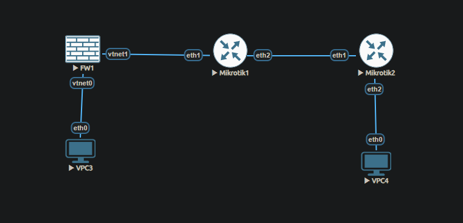
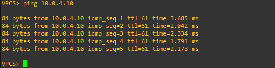
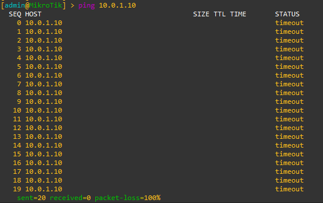
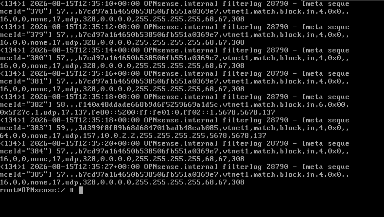

# Project 2 — OPNsense Firewall Lab

## Overview
A three-zone firewall deployment using OPNsense in EVE-NG. Demonstrates 
real enterprise firewall concepts including interface segmentation, traffic 
filtering, and firewall logging.

## Network Topology
VPC3 (LAN) --- vtnet0/OPNsense/vtnet1 --- Mikrotik1 --- Mikrotik2 --- VPC4 (DMZ)
10.0.1.10 10.0.1.1 10.0.2.1 10.0.2.2/10.0.3.1 10.0.3.2/10.0.4.1 10.0.4.10
## IP Address Table
| Device | Interface | IP Address |
|--------|-----------|------------|
| VPC3 | eth0 | 10.0.1.10/24 |
| OPNsense | vtnet0 (LAN) | 10.0.1.1/24 |
| OPNsense | vtnet1 (WAN) | 10.0.2.1/24 |
| Mikrotik1 | ether1 | 10.0.2.2/24 |
| Mikrotik1 | ether2 | 10.0.3.1/24 |
| Mikrotik2 | ether1 | 10.0.3.2/24 |
| Mikrotik2 | ether2 | 10.0.4.1/24 |
| VPC4 | eth0 | 10.0.4.10/24 |

## Firewall Rules Implemented
| Rule | Direction | Action | Result |
|------|-----------|--------|--------|
| LAN to any | inbound vtnet0 | allow | VPC3 can reach all networks |
| WAN to LAN | inbound vtnet1 | block + log | External hosts cannot reach LAN |

## Evidence
### Topology

### LAN to WAN — Traffic Allowed

### WAN to LAN — Traffic Blocked

### Firewall Log — Blocked Traffic

## What I Demonstrated
- Deployed OPNsense firewall in a simulated enterprise network
- Configured interface segmentation (LAN vs WAN)
- Implemented stateful firewall rules using pfctl
- Verified unidirectional traffic policy — LAN can reach WAN, WAN cannot reach LAN
- Confirmed firewall logging of blocked traffic with timestamps
- Added static routes for multi-hop network reachability
- Persisted firewall rules and routes across reboots via rc.local

## Tools Used
- EVE-NG Community Edition
- OPNsense 26.1.6 (FreeBSD based)
- Mikrotik RouterOS CHR 7.1
- VPCS
- pfctl (BSD packet filter)

## Key Concepts Demonstrated
- Stateful firewall rules
- Interface-based traffic segmentation
- Firewall logging and monitoring
- Static routing across multiple hops
- Network security policy enforcement
